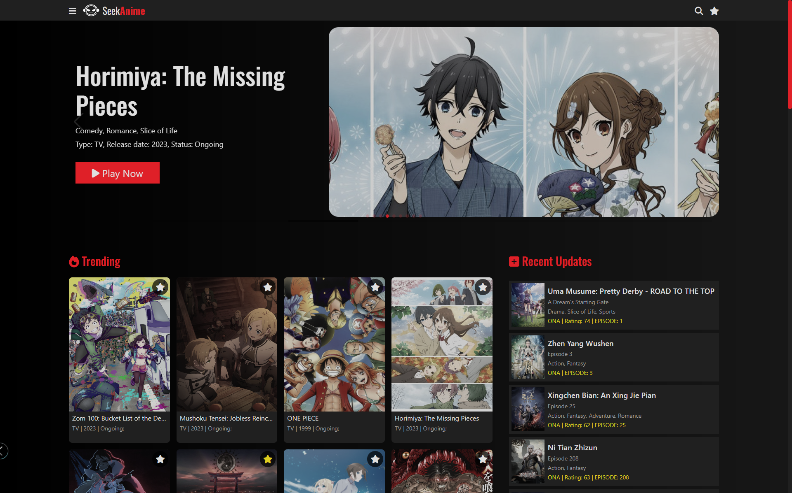
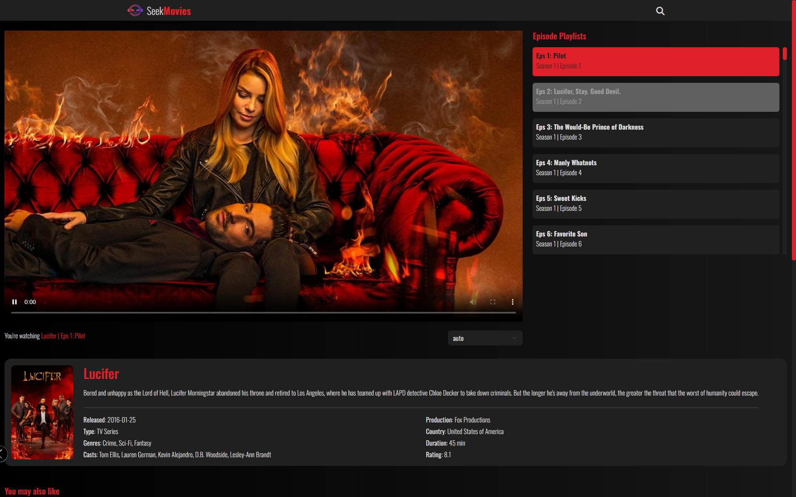
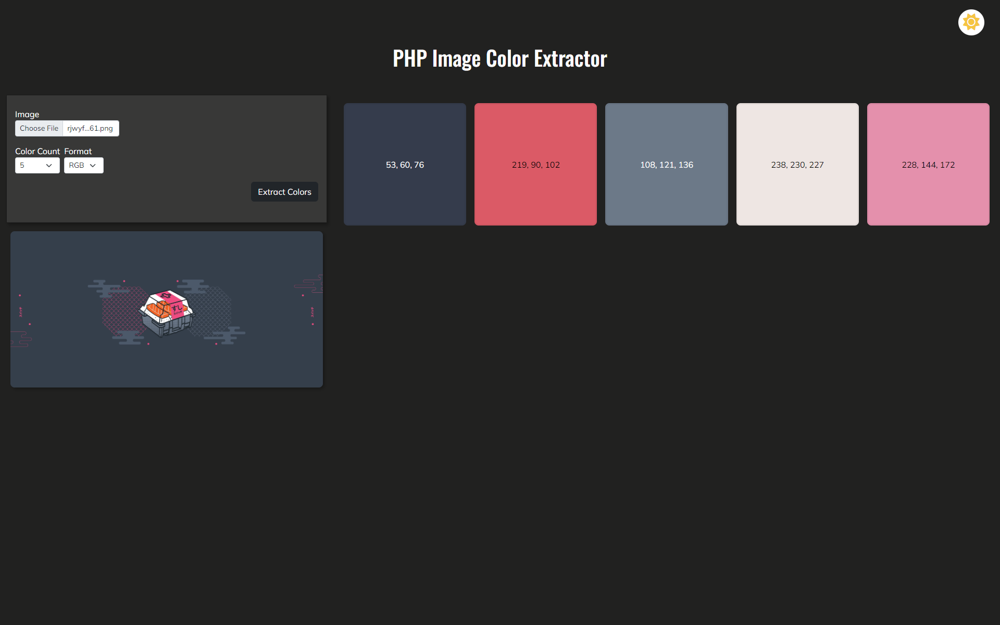

# Welcome to Devpapi's Portfolio

I'm a passionate web developer dedicated to creating stunning websites and web applications.

- [About Me](#about-me)
- [Skills](#skills)
- [Portfolio](#portfolio)

# About Me

I'm Devpapi, a web developer with over 4 years of experience. I love exploring and learning new things in technology.

<!--  -->

# Skills

- Node.js
- Express JS
- SvelteKit
- HTML, CSS, JavaScript
- Bootstrap, PHP
- MySQL
- Responsive Design
- Linux, Windows
- Git & GitHub
- Linux, Windows (OS)
- Apache2

In my free time, I enjoy playing video games, watching movies, and contributing to open-source projects.

# Portfolio

## Project 1: Anime Streaming Site (Sveltekit+Express_API+API)

- Description: (Personal Project) Developed a fully functional anime streaming site where API is hosted on Linux server.
- Technologies: Nodejs, Sveltekit, Express (API) Tailwind, Skeleton UI, CSS Javascript, TypeScript, Cloudflare, Vercel.
- [View Project](https://verceltest.devpapi.online/)
- [GitHub Repository (Private)](#!)

## Project 2: Anime Streaming Site

- Description: (Personal Project) Developed a fully functional anime streaming site hosted on a linux server using HTML, CSS, Javacript, PHP, Node.js
- Technologies: HTML, CSS, Javascript, Bootstrap5, PHP, Apache2, Node.js.
- [View Project](http://seekanime.devpapi.online/home)
- [GitHub Repository (Private)](#!)

## Project 3: Movie Streaming Site

- Description: (Personal Project) Developed a fully functional movie streaming site hosted on a linux server using HTML, CSS, Javacript, PHP, Node.js
- Technologies: HTML, CSS, Javascript, Bootstrap5, PHP, Apache2, Node.js.
- [View Project](http://seekmovies.devpapi.online/)
- [GitHub Repository (Private)](#!)

## Project 4: PHP Image Color Extractor

- Description: A fully functional website that extract the colors from the image. It helps designer to pick the appropriate color for the design based on the image they use.
- Technologies: HTML, CSS, Javascript, Bootstrap, PHP.
- [View Project](#!)
- [GitHub Repository (Private)](https://github.com/devpapi0891/image-color-extractor.git)

<!-- # Contact Me

Feel free to get in touch with me. You can use the form below or reach out through email or social media.

Email: [rafael50891.dev@gmail.com](mailto:rafael50891.dev@gmail.com)
LinkedIn: [View here](#!)
GitHub: [github.com/yourusername](https://github.com/yourusername) -->

Let's work together to bring your web project to life!

